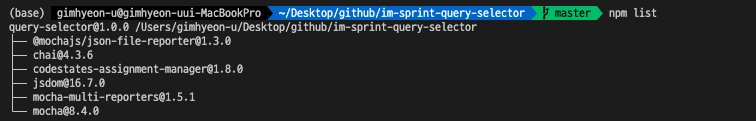

## test

### test2

## test


testtest

```javascript
// 동영상 강의에 나온 코드를 그대로 실습하세요


//input
let elInputUsername = document.querySelector('#username');
let elInputPassword = document.querySelector('#password');
let elInputPassword_Re = document.querySelector('#password-retype');

//message
let elFailureMessage = document.querySelector('.failure-message');
let elSuccessMessage = document.querySelector('.success-message');
let elMismatchMessage = document.querySelector('.mismatch-message');


function isMoreThan4Length(value) {
  return value.length >= 4;
}

function isMatch (password1, password2) {
  return password1 == password2;
}

// ID 검증
elInputUsername.onkeyup = function () {
  if(isMoreThan4Length(elInputUsername.value)) {
      elFailureMessage.classList.add('hide');
      elSuccessMessage.classList.remove('hide');
  } else {
    elFailureMessage.classList.remove('hide');
    elSuccessMessage.classList.add('hide');
  }
}

// PW 검증
elInputPassword_Re.onkeyup = function () {
  if(isMatch(elInputPassword.value,elInputPassword_Re.value)) {
    elMismatchMessage.classList.add('hide');
  } else {
    elMismatchMessage.classList.remove('hide');
  }
}
```



