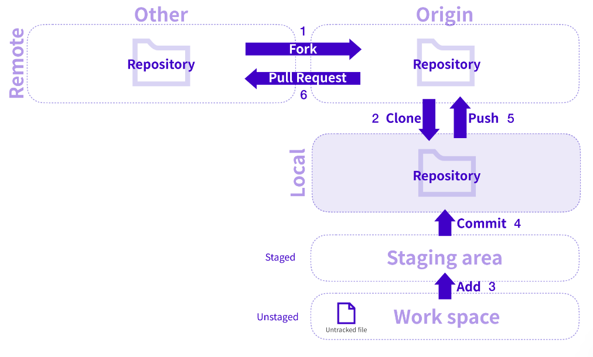

# Git, Github

----------------------

**Git**이란 개발자의 코드를 효율적으로 관리하기 위해서 개발된 '분산형 버전 관리 시스템'으로 변경사항 및 버전을 추적하기 용이한 시스템이다.

 **Github**란 Git Repository를 관리할 수 있는 클라우드 기반 서비스이다.

* Repository

  
  
  {: .align-center}


## Git 명령어

위와 같이 Git과 Repository를 통해 효율적으로 코드를 관리하고 공유할 수 있다. 이에 혼자 작업 할 때, 함께 작업할 때, 브랜치 작업 예시는 다음과 같다.


### 혼자 작업 workflow

---



1. Fork : Remote에 있는 다른 Repository에서 Remote에 있는 내 Repository에 가지고 온다.


{: .align-center}


2. Clone : Fork한 코드를 수정하기 위해 내 컴퓨터로 가져온다.

```bash
git clone <Repository URL>
```


3. Add : 내 컴퓨터에서 작업한 파일을 git 관리하에 있는 상태인 Staging Area에 올려줄 수 있다.

```bash
git add . 
git add <changed file name>
```

- 이때 Staging Area의 상태 및 추적되지 않은 파일(Untracked File)은 "git status" 명령어로 확인 가능하다.
- 또한, 이 단계까지(commit 전)는 "git restore [file name]" 명령어로 변경 사항을 돌릴 수 있다.


4. Commit : stagin area에 들어온 파일을 내 remote repository에 push하기 위해 commit 과정을 거친다. 

```bash
git commit -m "commit msg"
```

- 현재까지 커밋된 내역들을 "git log"를 통해 확인할 수 있다.
- commit을 취소하고 싶다면 "git reset"으로 취소할 수 있다. 


5. Push : 커밋한 파일을 자신의 Repository에 기록한다.

```bash
git push origin <branch name>
```


### 내가 작업한 코드를 함께 작업

---

1. Init : 내가 local에서 작업한 directory를 git 관리하에 넣는다.

```bash
git init
```


2. Remote Add : 작업한 Local Repository를 github에서 원격으로 관리하기 위해 Local Repository와 Remote Repository를 연결한다.(이 때, 내 작업 폴더는 깨끗해야 한다.("git status" 확인))

```bash
git remote add origin(short name) <Repository URL>
```

- 이 때, Repository URL에 같이 작업하는 사람의 Repository URL을 넣는다면 나의 Local Repository와 상대방의 Repository와 연결할 수 있다.
- 또한, 이렇게 연결된 목록은 "git remote -v"를 통해 확인할 수 있다.


3. Pull : Remote Repository의 작업 내용을 가져온다.

```bash
git pull <short name> <branch>
```

- 작업 내용을 받아오면 받아오는 내용은 자동으로 병합(merge)된다.
- 이 때, 동일한 라인을 수정한 파일이 존재한다면 병합되지 않고, 충돌이 발생하는데, 이는 "git status"에서 확인이 가능하다.
  - 또한, 충돌한 부분을 해결하려면
    - Accept Current Change : 내가 수정한 내용으로 파일에 반영
    - Accept Incoming Change : Remote Repository의 내용으로 파일에 반영
    - Accept Both Changes : 변경 사항 모두를 반영
    - 혹은 직접 수정
  - 으로 선택해서 해결이 가능하다.
  - 수정을 마치면, 병합 커밋을 생성해주기 위해 파일을 staging area로 올리고 commit(자동 커밋 메시지 생성), push가 가능하다.


