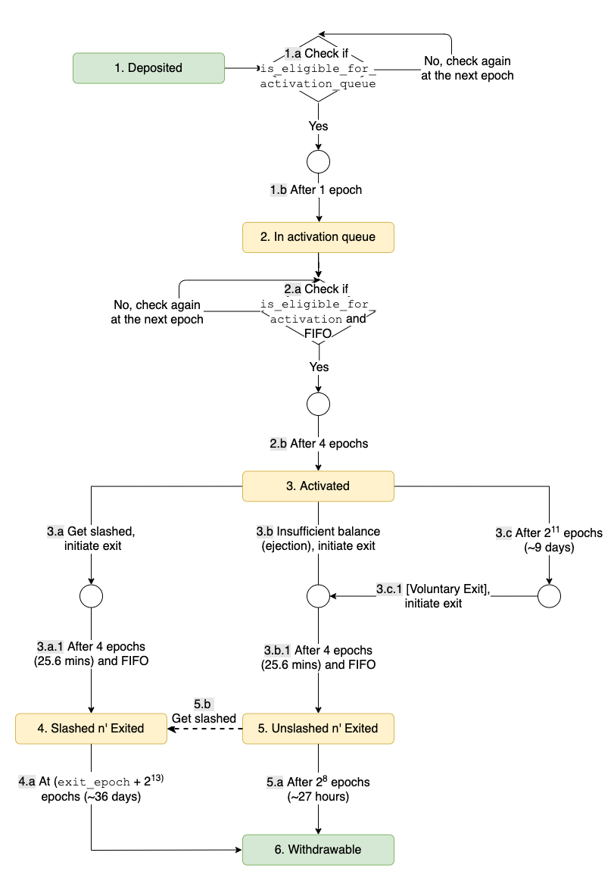

# The Merge

------

"The Merge"란 이더리움의 원래 실행 계층과 새로운 지분 증명 합의 계층인 Beacon Chain을 결합한 것이다. 

Beacon Chain은 원래 메인넷 트랜잭션을 처리하지 않고 유효성 검사자와 계정 잔액에 동의하여 자체 상태에 대한 합의만 담당하였지만, "The Merge"이후 Beacon Chain은 실행 계층 거래 및 계정 잔액을 포함한 모든 네트워크 데이터의 합의 엔진이 되었다.

## Beacon Chain

### Beacon Chain의 핵심 기능

---

Beacon Chain의 핵심 기능은 자체 체인에 대한 지분 증명 프로토콜을 관리하는 것이다.

여기에는

- 유효성 검사기 및 해당 지분 관리
- 위원회와 제안자 구성
- 합의알고리즘 적용
- 합의 규칙 적용 검증자에게 보상 및 패널티 적용

가 있다.

### Beacon Chain의 자료 구조

---

#### BeaconState

---

BeaconState는 Beacon Block으로 구성된 체인의 상태 전이 함수를 실행한 결과 변경되는 비콘체인 자체의 상태를 의미한다. Beacon State에는 Fork 버전, 캐시 기록, ETH 1체인에 대한 정보, 검증자 목록, 검증자 랜덤 선정을 위한 랜덤성에 대한 정보, 과거 검증자 처벌 기록, 최근의 검증 투표, 최근의 크로스링크, 완결성(Finality)에 대한 정보등이 포함된다.

- Cross Link와 Shard
  - Cross Link : 샤드체인의 샤드블록의 상태들이 주기적으로 비콘체인에 기록되기 위한 참조 역할을 하는 데이터
    - 샤드 체인의 완결성 보장 목적
    - 각 샤드체인마다 비콘체인의 검증자 풀 중 일부가 샤드체인의 위원회로 구성되며, 해당 위원회가 샤드체인을 비콘체인과 크로스링크
    - 일반적인 경우 각 샤드는 비콘체인에 에폭당 한 번 기록

#### Beacon Block

---

Beacon Block은 Beacon Chain의 핵심 요소로, 헤더 부분과 블록 바디로 구성된다. 기존의 블록과 마찬가지로 Beacon Block의 헤더는 주로 바디에 포함된 정보나 현재 상태 데이터의 루트를 포함한다. 바디 부분은 비콘체인의 트랜잭션에 해당하는 데이터를 포함되며, 이는 주로 검증자들의 행동과 상태에 대한 내용들이 있다.

### Beacon Chain WorkFlow

----

#### 슬롯 및 에포크

----

- Slot : 12초
  - 시스템이 최적으로 실행될 때 1slot마다 하나의 블록 추가
  - 따라서 1slot마다 꼭 하나의 블록이 생성되는 것은 아님
- Epoch : 64개의 Slot
  - 에포크마다 검증인들이 랜덤하게 여러 위원회로 구분되어 선정

#### 유효성 검사기 관리 및 증명

---

유효성 검사기는 Ethereum의 합의를 실행한다.

검증자는 블록을 구축하기 위해 의사 무작위로 선택되며, 블록 제안자와 제안된 블록에 투표하는 증명자들(위원회)로 구성된다.

{: .align-center}

위와 같이 의사 무작위로 선택된 검증자는 각 슬롯마다 존재하며, 블록 제안자가 제안한 블록이 투표되면 제안자는 보상을 받는다.

또한, g와 같이 슬롯이 블록 제안자가 오프라인 상태이거나 Sync가 맞지 않아 제안되지 못할 경우 블록 제안자로 선택된 검증자는 보상을 받지 못한다.

여기서 증명은 유효성 검사기의 잔액에 가중치가 부여된 유효성 검사기의 투표이고, 증명은 블록 외에도 유효성 검사기에 의해 브로드 캐스트된다.

또한, 유효성 검사기는 서로를 감시하고 충돌하는 투표를 하거나 여러 블록을 제안하는 다른 유효성 검사기를 보고하여 보상을 받는다.

즉, 이더리움에서는 사용자가 ETH를 스테이킹하여 유효성 검사기를 활성화하고 제어한다.

이더리움에서는 32ETH 스테이킹마다 하나의 유효성 검사기가 활성화된다.

유효성 검사기는 Beacon Chain 노드를 사용하는 유효성 검사기 클라이언트에 의해 실행되며, 해당 클라이언트는 Beacon 노드 기능을 구현하거나 Beacon 노드를 호출할 수 있다.

#### 위원회

---

위원회는 유효성 검사기 그룹으로, 보안을 위해 각 슬롯에는 최소 128명의 유효성 검사기로 구성된다.

구성하는 방법은 공격자가 위원회를 통제하는 것을 방지하기 위해 Beacon Chain은 [RANDAO](https://apfl99.github.io/danksharding/TheMerge/#randao)라고하는 유사 무작위 프로세스로 구성한다.

{: .align-center}

위원회가 RANDAO를 통해 구성되면, 

{: .align-center}

위 그림과 같이 증명을 하게 되는데, 

- 위원회 A 중 2명의 검증자는 Alice가 제안한 블록을 슬롯 1로 증명하고, 1명의 검증자는 오프라인 상태이다.
- 위원회 B 중 2명의 검증자는 슬롯 2에 Bob이 제안한 블록을 슬롯 2로 증명하고, 1명의 검증자는 데이터를 잘못 받아 Alice가 제안한 블록을 슬롯 2로 증명했다.
- Eve가 제안한 블록의 경우 위원회 C의 모든 검증자가 슬롯 3으로 증명했다.

이 경우, 슬롯 2에서 체인이 나뉘는 포크가 발생하게 되는데, 이를 해결하기 위해 Beacon Chain에서는 [LMD GHOST](https://apfl99.github.io/danksharding/TheMerge/#lmd-ghost)를 사용한다.

#### 비콘 체인 체크포인트

---

체크포인트는 에포크의 첫번째 슬롯에 있는 블록으로, 해당 블록이 없으면 체크포인트는 이전의 가장 최근 블록이다.

에포크당 항상 하나의 체크포인트 블록이 있으며, 한 블록이 여러 에포크의 체크포인트가 될 수 있다.

{: .align-center}

위 그림과 같이 65~128슬롯이 비어있어, 에포크 2 체크포인트는 슬롯 128(64 *2)의 블록이 되어야 하지만, 슬롯이 없기 때문에 64 슬롯이 다시 체크포인트가 되고, 에포크 3도 마찬가지로 192(64 *3)이 되어야 하지만 슬롯이 없기 때문에 180이 체크포인트가 된다.

여기서 체크포인트를 결정하는 로직은 [FFG Vote](https://apfl99.github.io/danksharding/TheMerge/#casper-ffg)라고 부르는 투표를 진행한다. LMD GHOST의 경우 정해진 검증자만 진행하지만, FFG Vote는 모든 검증자가 에포크마다 한다.

체크포인트가 2/3이상의 투표를 얻는다면, 이 체크포인트는 justified되었다고 정의하고, justified된 체크포인트의 다음 체크포인트가 justified되면 이전의 체크포인트는 finalized되며, Finality를 갖는다.

#### 스테이킹 보상 및 페널티

---

1. 증명자 보상
   - 유효성 검사기는 대부분의 다른 유효성 검사기가 동의하는 증명(LMD GHOST 및 FFG Vote)에 대한 보상을 받는다. 완성된 블록의 증명은 더 큰 보상을 받는다.
2. 증명자 페널티
   - 반대로 유효성 검사기는 증명하지 않거나 완료되지 않은 블록을 증명하는 경우 페널티를 받는다.
3. 스테이커에게 발생할 수 있는 부정적인 위험
   - 항상 오프라인 상태이거나 확정되지 않은 블록에 항상 투표하는 검증인은 검증인이 확정된 정확한 증명에 대해 보상받는 금액의 3/4에 해당하는 불이익을 받게 된다.
   - 오프라인 상태에 따라 페널티가 발생한다.
4. Slashing 및 내부 고발자 보상
   - Slashing은 0.5ETH 이상에서 유효성 검사기의 전체 지분에 이르는 페널티이다.
   - Slashing은 Slashable Offences에 해당되어야 하며, Slashable Offences를 한 검증인은 잔액의 최소 1/32를 잃고 비활성화 된다.
   - 해당 유효성 검사기는 8,192 에포크동안 오프라인인 것처럼 패널티를 받으며, 비슷한 시간에 다른 사람들이 Slashing을 얼마나 했는지에 따라 추가 페널티를 부과한다.
     - Validator_balance * 3 * fraction_of_validators_slashed
     - 모든 유효성 검사기의 1/3이 비슷한 시간에 Slashable Offences를 저지르면 전체 잔액을 잃는다.
     - Slashable Offences를 신고한 검증인은 내부고발자 보상을 받는다.
5. 제안자 보상
   - 지속적으로 온라인 상태를 유지하며 정상적인 일을 하는 유효성 검사기는 새로운 증명으로 블록을 제안하는 데 대한 총 보상의 1/8을 받는다.
   - Slashing이 발생하면 제안자는 Slashing Proof를 블록에 포함하는데 대한 작은 보상도 받는다.
   - 현재 내부고발자 보상금은 모두 제안자에게 준다.
6. 비활성에 대한 페널티
   - 최종 이후 4개 이상의 에포크가 있는 경우, 유효성 검사기는 체크포인트가 완료될 때까지 2차적으로 증가하는 비활성 페널티를 받는다.
   - 유효성 검사기의 50%가 오프라인 상태가 되면 블록은 18일 후에 완결된다.
   - 비활성 페널티를 받은 검증자를 강제 종료로 배출하여 다른 검증자가 최종성을 재개할 수 있는 2/3다수가 되도록 한다.

#### Slashable Offences

---

1. Double Proposal
   - 할당된 슬롯에 대해 둘 이상의 블록을 제안하는 제안자

2. LMD GHOST Double Vote
   - 할당된 슬롯에 대해 두 개의 서로 다른 Beacon Chain 헤드를 증명하는 유효성 검사기
3. FFG Surround Vote
   - 검증자가 진행한 FFG vote가 이전의 FFG vote에 의해 둘러싸거나 둘러싸인다.
   - 예를 들어 에포크 5가 32~128 slot의 범위를 가지고 있다면,
     - 에포크 6이 64~96의 범위를 가진 경우, 에포크 6은 에포크 5에 의해 둘러싸이고
     - 에포크 6이 0~160의 범위를 가진 경우, 에포크 6은 에포크 5를 둘러싸는 것을 말한다.
   - 이 경우, 둘러싸인 에포크가 생기기 때문에 블록을 임의로 포함시키거나 배제시킬 수 있다.

4. FFG Double Vote
   - 동일한 에포크에서 두 대상에 대해 2개의 FFG vote를 하는 검증인

#### 비콘 체인 유효성 검사기 활성화 및 Lifecycle

---

각 유효성 검사기는 활성화되기 위해 32ETH의 잔액이 필요하다. 이더리움 메인넷의 예금 예약에 32ETH를 스테이킹하는 사용자는 하나의 유효성 검사기를 활성화한다.

비콘 체인은 잔액이 16ETH에 도달한 모든 유효성 검사기를 비활성화한다. 

유효성 검사기는 약 9일동안 2,048 에포크 동안 서비스를 제공한 후 자발적인 종료를 할 수 있다.

자발적 또는 비활성화에서는 스테이커가 지분을 인출하기 전에 4에포크의 지연이 있다. 4에포크 내에서 검증자는 Slashing 될 수 있다. 정직한 검증인 잔액은 약 27시간 후에 인출가능하고, Slash된 유효성 검사기는 인출에 36일의 지연이 있다.

 

### BeaconChain 적용 기술 설명

---

#### RANDAO

---

컴퓨터는 본질적으로 동일한 입력이 주어지면 항상 동일한 출력을 생성하는 결정론적인 시스템이기 때문에 합리적인 난수를 생성하기 위해 컴퓨터는 시드에 의존한다. 

이를 BeaconChain에서는 무작위로 검증자를 선택하기 위해 RANDAO로 간단한 commit-reveal방식을 사용한다.

단계는 세단계로,

1. 유효한 sha3 수집
   - 난수 생성에 참여하고 싶은 사람은 누구나 지정된 기간에 m ETH를 약속으로 컨트랙트 C에 거래를 sha(s)의 결과와 함께 보낸다.
   - 이때, s는 참가자가 선택한 비밀번호이다.
2. 유효한 데이터 수집
   - 이후 sha3(s)를 제출한 사람은 누구나 지정된 기간 내에 1단계에서 비밀번호인 s로 트랜잭션을 컨트랙트 C로 보내고, 컨트랙트 C는 s에 대해 sha3을 실행하여 이전에 커밋된 데이터와 비교하여 s가 유효한지 확인한다.
   - s가 유효하다면 시드 컬렉션에 저장되어 최종적으로 난수를 생성한다.
3. 난수 계산, 약정된 ETH 및 보너스 환불
   - 모든 비밀번호가 성공적으로 수집된 후 컨트랙트 C는 함수 f(s1,s2,...,sn)에서 난수를 계산하고 결과는 C의 저장소에 기록되고 결과는 난수 생성을 요청한 컨트랙트로 전송된다.
   - 컨트랙트 C는 참여자에게 서약을 되돌려 보내고, 수익은 균등하게 분할하여 모든 참여자에게 전송된다.
   - 수익은 난수를 요청한 다른 컨트랙트에서 지불하는 수수료이다.

{: .align-center}

그러나 RANDAO에도 단점이 존재하는데, 마지막 공개자 공격(Last REvealer Attack)으로 마지막으로 비밀값을 공개하는 참가자는 미리 결과값을 계산할 수 있게 되어 자신의 비밀값을 공개하거나 비공개하여 자신에게 유리한 값이 생성되도록 유도할 수 있다

이에 이더리움에서는 VDF(Verifiable Delay Function)을 제안했는데, 이는 입력 후 일정시간 이후 출력되는 값이 나오는 함수이다.

예를 들어 

{: .align-center}

위와 같이 입력값과 난이도(지연시간)를 입력하면 출력값과 출력값을 검증하기 위한 Proof가 출력된다.

이를 통해 출력값이 입력값을 통해 계산되어 진 것인지에 대한 검증이 Proof를 통해 역연산보다 빠르게 가능하며, 악의적인 행위자가 시드로부터 의사 난수를 계산하는 데까지 걸리는 시간을 지연시켜 마지막 공개자 공격을 방지한다.

추가적으로 Beacon Chain에서는 

{: .align-center}

VDF의 연산 결과가 다시 RANDAOmixing에 초기값으로 사용되어, 난수 생성 사이클은 병렬적으로 오프체인에서 수행됨으로써 지속적으로 난수가 발생할 것이다.

#### Gasper

----

Gasper는 이더리움 2.0의 Beacon Chain의 합의 알고리즘으로 사용되며, PoS기반의 합의 프로토콜이다. Gasper는 완결성을 보장하기 위한 Casper FFG와 Fork-choice rule을 위한 LMD GHOST를 수정 및 결합하였다.

##### LMD GHOST

---

LMD GHOST는 Latest Message Driven Greediest Heaviest Observed SubTree의 약자로, 가장 최근의 메시지를 기반으로 하여 가장 많은 참가자가 선택한 체인을 따르도록 하는 것이다.

비탈릭의 논문에서는 무게라는 표현을 쓰는데 이는 블록을 지지하는 검증자의 지분을 곱한 값을 모두 더한 값이다.

{: .align-center}

LMD GHOST의 알고리즘을 나타내면 위와 같은데,

2. 제네시스 블록에서 시작해서
3. 검증자에게 가장 최근 검증 투표 메시지들로
4. 자식 블록이 없을 때까지
5. 가장 많은 비중을 차지한 블록이 선택된다.

{: .align-center}

위 그림과 같이 LMD GHOST는 제네시스 블록부터 시작해서 최근 메시지 중 가장 많은 수가 지지하는 쪽의 포크를 선택하고, 이를 계속해서 자식 블록이 없을 때까지 진행한다. 이를 통해 현재 체인의 헤드가 무엇인지 결정할 수 있다.

이러한 구조가 가져오는 이점은 지연율이 높은 상황에서 올바른 포크를 선택할 수 있다는 데에 있다. 

Longest Chain Rulte에서 지연이 발생하게 되면 검증인의 투표 결과에 따라 체인이 변경될 수 있는 반면, LMD GHOST의 경우 두 명의 검증인이 동일한 블록을 부모 블록으로 하는 다른 두 개의 블록을 각각 생성 했을 경우, 이 둘은 서로 배치되는 투표를 하였지만, 사실상 동일한 부모 블록에 대해 투표한 것과 똑같기 때문이다.

##### Casper FFG 

----

Casper FFG는 Casper the Friendly Finality Gadget의 약자로 PoS 기반의 하이브리드 알고리즘이다.

{: .align-center}

위와 같이 검증인 투표메시지는 구성된다.

- s : 이미 Justified가 완료된 체크포인트
- t : s의 자손 체크 포인트 중 하나 (s와 t가 반드시 인접한 체크포인트일 필요는 없음)
- h(s), h(t) : 각각 s와 t의 높이

이에 Gasper 알고리즘에서는 h를 1에포크의 길이로 잡아 매 에포크의 마지막 블록이 확인점이 되도록 한다. 그리고 확인점이 정의가 되면, 새로운 확인점 기준을 기존의 확인점인 s 블록에서 새로운 확인점인 t 블록으로 옮기는데 찬성한다는 검증자의 투표 행위인 입증을 진행한다.

입증은 입증을 한 검증자의 지분이 곱해져 입증마다 서로 다른 무게를 갖는다.

이러한 입증이 2/3를 넘어가면 t블록이 검증(Justification)되었다고 정의하며, 이 경우를 Supermajority Link가 생겼다고 정의한다.

이후 s가 검증된 상태에서 h(t) = h(s) + 1(인접한 블록)인 t블록에 대하여 Supermajority Link가 존재한다면 s는 완결(Finalized)되었다고 정의한다.

이와 같은 투표과정에서 Slashing Conditions는 2가지이다.

1. 동일한 높이에 충돌되는 두 개의 다른 체크포인트를 투표할 수 없다. => 이중 투표 방지
2. 하나의 체크포인트 쌍(s1,t1)의 높이 h(s1), h(t1) 사이에 있는 쌍(s2, t2)에 투표할 수 없다는 것이다. => 서라운드 투표 방지

이러한 패널티는 PoS에서 포크 발생시, 노드가 투표할 때 두 블록체인에 모두 투표를 해도 이 노드가 전혀 손해보는 것이 없는 Nothing at Stake문제를 해결하기 위함이다. 보증금을 삭감당하지 않는 이상, 동일한 높이의 충돌되는 두 개의 다른 체크포인트가 모두 Finalized되는 것이 불가능하기 때문에 Accountable Safety를 보장할 수 있고 항상 새로운 체크포인트가 Finalized 될 수 있고, 새로운 블록이 계속해서 생성될 수 있기 때문에 Liveness도 보장된다.

 

  <h5>Reference</h5>
  1) <a>https://ethereum.org/ko/upgrades/merge/</a>
   
  2) <a>https://medium.com/onther-tech/%EC%9D%B4%EB%8D%94%EB%A6%AC%EC%9B%802-0-%EA%B9%8A%EC%9D%B4%EB%B3%B4%EA%B8%B0-%EC%8B%9C%EB%A6%AC%EC%A6%88-eth-2-0-explained-phase-0-1%ED%8E%B8-74ee5659a40a</a>
   
  3) <a>https://ethos.dev/beacon-chain</a>
   
  4) <a>https://github.com/randao/randao</a>
   
  5) <a>https://slideslive.com/38911623/ethereum-20-randomness</a>
   
  6) <a>https://arxiv.org/pdf/2003.03052.pdf</a>
   
  7) <a>https://ethereum.stackexchange.com/questions/2402/what-exactly-is-the-nothing-at-stake-problem</a>
   
  8) <a>https://notes.ethereum.org/7CFxjwMgQSWOHIxLgJP2Bw#A-note-on-Ethereum-20-phase-0-validator-lifecycle</a>

