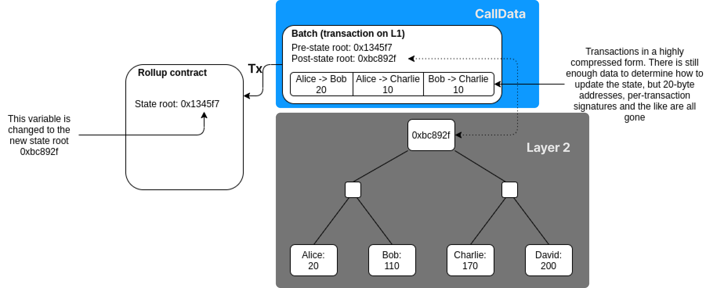

# DankSharding

----

DankSharding은 이더리움의 계층 중 데이터 가용성 계층에 해당하는 Shard Chain의 복잡한 디자인을 단순화하기 위한 제안으로, 해당 글에서는 DankSharding 이전 상황의 Shard Chain에서 DankSharding이 단순화를 위해 적용한 기술들에 관하여 설명한다.

## DankSharding 이전 상황

### 이더리움 트릴레마

---

블록체인 기술이 금융을 포함한 다양한 산업 분야에서 유용함을 입증하고 있지만, 기존의 중앙 집중형 네트워크와 비교했을 때, 보편적으로 사용되기는 아직해결해야 할 문제가 많다. 대표적인 예시로, 다음과 같이

- 확장성(Scalable): 사용자 수가 늘어나더라도 유연하게 대응할 수 있는 정도
- 탈중앙성(Decentralized): 중앙집권화를 벗어나 분산된 소규모 단위가 모여 자율적으로 운영되는 정도
- 보안성(Secure): 블록체인 내의 데이터나 프로그램을 권한이 없는 이용자가 사용할 수 없도록 제한하여, 외부의 공격으로부터 프로그램을 보호하는 정도

를 모두 충족시킬 수 없는 블록체인 트릴레마가 있다. 블록체인 트릴레마 측면에서 현재 이더리움은 탈중앙성과 보안성에 중점을 둔 체인으로, 확장성의 경우 중앙집중형 네트워크인 Visa가 약 24,000 TPS를 처리할 수 있는 반면, 이더리움의 TPS는 약 15TPS로 이더리움은 확장성 문제를 해결하기 위해 많은 업데이트들이 제안되었다.

## Ethereum Layer

이에 현재 이더리움의 방향은 롤업 중점의 로드맵인데, 롤업은 다음과 같이

 

외부 체인(Layer 2)에서 트랜잭션을 실행하고 메인 체인(Ethereum, Layer 1)으로 수백 개의 압축된 트랜잭션 모음과 증명이나 서명을 Layer 1의 트랜잭션 CallData 영역에 게시함으로써 메인 체인의 보안을 상속받는 솔루션으로, 현재 이더리움에 도입 시, 

- 현재 이더리움 블록당 가스 한도: 1250만개
- CallData의 바이트당 가스 비용: 16Gas
- 롤업 검증 데이터(서명이나 증명) 비용: 50만 Gas(추정)
- 롤업에서 하나당 트랜잭션 용량: 12bytes
- 평균 블록 생성 시간: 13초

**=> 하나의 블록에서 롤업 검증 데이터를 제외한 트랜잭션이 들어갈 수 있는 용량: (1250-50)만/16 = 75만 bytes**

**=> 하나의 블록 안에 들어갈 수 있는 트랜잭션 개수: 75만/12 = 62,500개**

**=> TPS: 62,500/13 = ~4807TPS**

 확장성 성능 지표인 TPS(Transaction Per Second)에서 우수한 예측값을 보여주면서 이더리움은 다음과 같은 롤업 중점의 로드맵을 제시했다.

해당 로드맵은 Main Chain, Beacon Chain, Shard Chain, Rollup으로 구성되는데, 각 주요 역할은 다음과 같이

- Main Chain: 이더리움의 전체적인 상태(State, Tx, Receipt)를 저장 및 업데이트
- Beacon Chain: PoS(Proof of Stake)합의 계층으로써, Main Chain에 상태를 업데이트하기 전, 블록 생성 및 검증에 필요한 작업
  - 검증자(Validator), 보증금(Stake) 관리
  - 검증자를 위원회(Committee)와 블록 제안자(Proposer)로 배치
  - 위원회의 투표로, 블록에 대한 분기 및 완결성 보장
  - 검증자에 대한 보상과 처벌
- Shard Chain: 데이터 가용성(Data Availability) 계층으로써, 롤업을 통해 게시된 데이터나 각 샤드 간의 데이터 가용성 증명
- Rollup: 실행(Execution) 계층으로써, 트랜잭션 실행 및 계산, 압축된 트랜잭션 데이터 모음과 증명이나 서명을 Shard Chain으로 게시

동작되며, 종합해서 정리하자면 롤업에서 발생하는 트랜잭션을 Shard Chain에서 데이터 가용성 증명 후, Beacon Chain에서 해당 트랜잭션을 검증함으로써 Main Chain에서 전체 상태를 업데이트하는 방식이다.

## Shard Chain

이더리움 롤업 중점의 로드맵에서 Shard Chain은 앞서 말한 것과 같이 데이터 가용성 계층으로, 여기서 데이터 가용성이란 "데이터가 정상 상태에서 사용될 수 있는 유효한 정도"이다. 이는 롤업과 샤딩을 도입하는데 중요한 개념으로, 롤업에서 Layer 1은 Layer 2의 전체 데이터를 가지고 있지 않고, 서로 다른 샤드간 트랜잭션에서 각 샤드는 자신의 샤드에 해당하는 데이터만 가지고 있는 상황에서 검증은 다음과 같은 구조에서  

머클 루트 재계산을 통해 이루어지는데, 만약 다음과 같은 머클 트리에서 데이터 C를 증명하고자 할 때, 

Layer 2의 Aggregator와 샤드의 Proposer는 머클 루트를 계산하기 위한 D, H(A-B), H(A-H)를 게시한다. 그러나 이 때 악의적인 Aggregator나 Proposer가 H(E-H)를 게시하지 않고 데이터 가용성이 고려되지 않는다면, 롤업에서의 Layer 1 검증자나 샤드의 검증자는 우선 전달받은 데이터를 검증할 것이고, 해당 검증은 유효하지 않을 뿐더러 DoS 공격과 같은 자원낭비 문제를 발생할 수 있다.

따라서 이러한 문제와 같이 검증자가 전달받은 데이터가 정상 상태인지 유효한지 판단하는 문제를 데이터 가용성 문제라고 하며, 이를 해결하기 위해 Shard Chain에서는 

이와 같은 Origin Data, Erasure Coding으로 확장된 데이터, Merkle Proof로 구성된 Body와 KZG commitment, 제안자의 서명 등으로 구성된 Header의 구조를 가진 Blob 형태의 데이터를 사용한다.

### Blob

---
