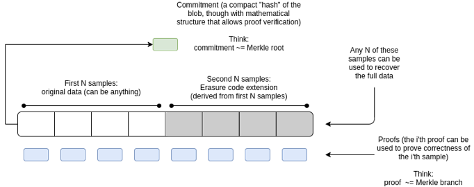

목차

- DankSharding 이란
- DankSharding 이전의 샤딩
- DankSharding에서의 샤딩
- Summary & Advantages

# DankSharding이란

DankSharding이란 다음과 같이 이더리움의 롤업 중점 로드맵 계층 중 데이터 가용성 계층에 해당하는 Shard Chain의 복잡한 디자인을 단순화하기 위한 제안으로, 

다음과 같이

각 샤드마다 위원회를 통해 데이터 가용성 증명을 한 후, 증명 결과 및 실행 데이터를 Beacon Block 제안자가 집계하여 Beacon Chain에 제안하는 방식에서, 각 샤드의 실행 데이터를 묶은 후, 각 샤드의 검증자들이 자신의 샤드에 해당하는 데이터에 대해 데이터 가용성 증명을 하고 Beacon Block 제안자가 Beacon Chain에 제안하는 방식으로 변경함으로써 각 샤드의 증명 결과를 집계하는 데에 필요한 디자인을 단순화시킨 Sharding 방식이다.

# DankSharding 이전의 샤딩

---

DankSharding 이전의 샤딩에서 각 샤드는 데이터 가용성 증명을 위해 Block이 아닌 다음과 같이 Blob 형태의 데이터를 사용하는데, 

이는 

- Body: Origin Data, Erasure Coding으로 확장된 데이터, Merkle Proof
- Header: KZG commitment로 생성된 KZG root

로 구성되며,여기서 사용하는 Erasure Coding, KZG commitment는 이더리움에서 사용하는 데이터 가용성 증명 방식인 DAS를 활용하기 위한 기술이다.

## Data Availability Sampling(DAS)

---

DAS란 데이터 가용성 샘플링으로, 

위와 같이 데이터 가용성 증명을 하는 클라이언트가 전체 데이터를 다운로드 받는 것이 아닌

위와 같이 이더리움에서 RLP인코딩을 통해 직렬화된 데이터를 이진 데이터로 나타내어 임의의 인덱스를 여러 라운드에 거쳐 다운로드함으로써 통계적인 보증을 얻는 방법이다.

그러나 여전히 검열되지 않은 데이터의 확률이 존재하며, 이를 보완하기 위해 데이터를 확장하는 Erasure Coding과 데이터가 올바르게 확장되었는지 검증하는 KZG commitment를 같이 사용한다.

## Erasure Coding

---

Erasure Coding이란 원래 손실되거나 손상된 데이터를 재구성하는 데 사용할 수 있는 중복 데이터를 생성하여 데이터 손실이나 손상을 방지하는 데 사용되는 기술로, DAS에서는 원래 데이터를 확장함으로써 데이터 일부가 손실되어도 나머지 데이터로 원래 데이터를 복구할 수 있도록 하여 샘플링에 의해 검열되지 않은 데이터가 생길 확률을 줄인다.

Erasure Coding에는 Reed-Solomon Code를 활용하는데, Reed-Solomon Code는 

1. Lagrange Interpolation(라그랑주 보간)
2. Modular 연산

으로 구성되어,  원래 데이터를 통해 Lagrange Interpolation으로 원래 데이터가 지나는 다항식을 구하여 해당 다항식 위의 점을 확장 데이터로 사용하고 Modular 연산을 통해 확장 데이터 값을 제한함으로써, 연산을 단순화한다. 이는 원래 데이터가 지나는 다항식으로 동작하기 때문에 확장된 데이터 중 일부 데이터가 손실되더라도 원래 데이터의 길이만큼 데이터가 남아있다면, 원래 데이터를 복구할 수 있다.

따라서 만약 원래 데이터의 길이가 k, 확장된 데이터의 길이가 2k라고 가정할 때 원래 데이터 복구에 필요한 데이터는 k이상이기 때문에 악의적인 노드는 DAS에 의해 검열되지 않기 위해 k+1이상 데이터를 숨겨야한다. 이는 한 번의 라운드에서 데이터가 가용할 확률을 약 50%(**(k+1)/****2k** )로 낮추고, 예를 들어 30번의 라운드가 진행된다고 할 때, 확률은 **2^(-30)**(약 10억분의 1)로 DAS를 효과적으로 보완한다.

## KZG commitment

---

KZG commitment는 증명자가 commitment 값인 타원곡선 점을 검증자에게 보낸 후, 증명자는 작업 중인 다항식을 변경할 수 없기 때문에 이를 commitment라고 하며, 하나의 다항식에 대해서만 유효성 증명이 가능한 특성을 활용하여 증명자가 제공하는 데이터(확장된 데이터)가 같은 다항식 내에 존재하는지 확인한다.

## Overall Process

---

## Rollup

---

여기서 롤업은 다음과 같이 

